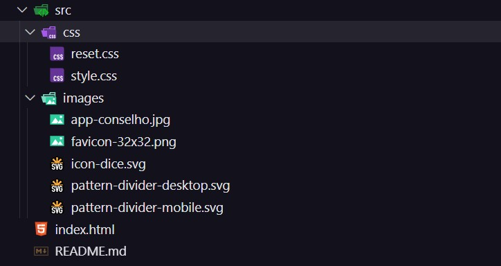
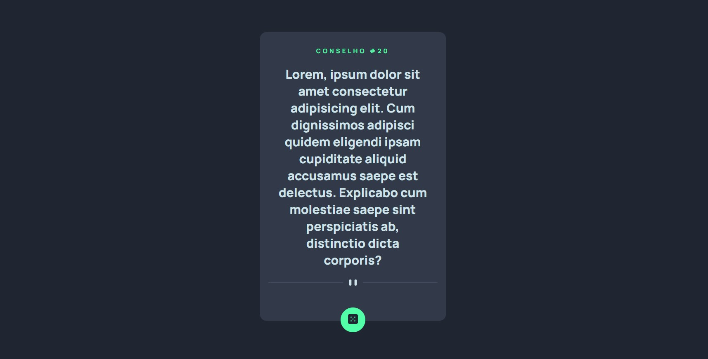

# 🧠 Projeto: Gerador de Conselhos (Card UI)

## 📋 Descrição

Este projeto é uma interface de cartão de conselhos, desenvolvida com foco em **HTML** e **CSS**. Ele simula a exibição de um conselho dentro de um card centralizado e estilizado, com um botão para gerar novas mensagens.

<blockquote style="font-size: 19px; background-color: #000; border-left: 5px solid #f1c40f; padding: 1em;">
  ⚠️ <strong>Projeto em andamento:</strong> 
  Futuras versões incluirão <strong>JavaScript</strong> para tornar o botão interativo e buscar conselhos reais via <strong>API</strong>.
</blockquote>

---

## 🔧 Tecnologias Utilizadas

- HTML5  
- CSS3  
- *(Futuramente)* JavaScript + Fetch API

---

## 📁 Estrutura de Pastas

---

## 🎯 Objetivos do Projeto

- Praticar estruturação de componentes com HTML.
- Estilizar interfaces responsivas e centradas com CSS.
- Planejar futura integração com JavaScript e API pública.
- Trabalhar tipografia e espaçamento para foco em leitura.

---

## 🖼️ Prévia Visual

---

## 📦 Funcionalidades Planejadas

- [x] Interface de card estilizado
- [x] Botão visual com ícone interativo
- [ ] Geração dinâmica de conselhos com JS
- [ ] Integração com a API [Advice Slip JSON API](https://api.adviceslip.com/)
- [ ] Efeitos de loading/transição ao trocar o conteúdo

---

## 📌 Status do Projeto
- 🔧 Em desenvolvimento, atualmente com foco no layout estático.
- 🔜 Integração futura com JavaScript para geração de conselhos dinâmicos.

---

## 🙋‍♂️ Autor
- Feito com 💻 por Guilherme Henry
- 📍 Belo Horizonte
- 📧 guilherme.henrydesigner@gmail.com